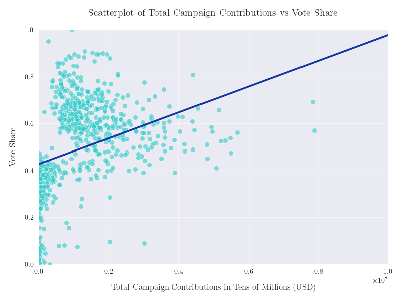
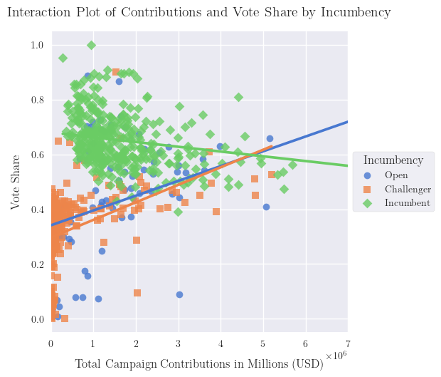
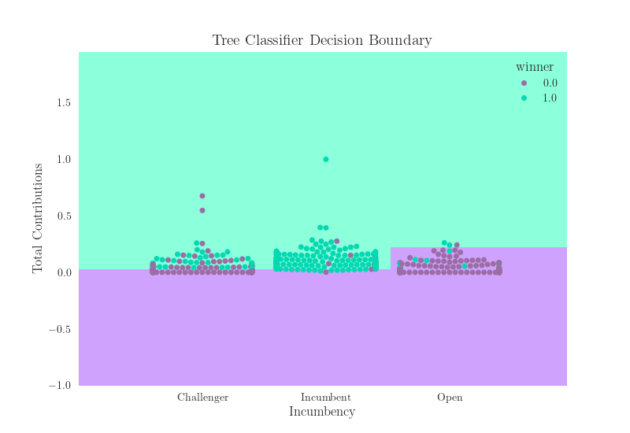

## Campaign Finance Analysis Pilot Project

 | 
| -------- | ------- |
 | 

 
### Overview

This proof-of-concept pilot analysis of FEC campaign finance and electoral outcome data uses conventional statistical methodology complemented by several machine learning algorithms to explore the effect of campaign contributions and candidate incumbency on the outcome of the 2016 House election. The overall approach and repository structure were developed with scalability in mind in order to facilitate extensions of the project to incorporate data from additional House election cycles. 

The primary file of interest within this repository is the notebook entitled [house_campaign_finance_analysis_2016](https://github.com/neophyte577/campaign-finance-house-2016/blob/main/analysis/primary-analysis-larger-dataset/house_campaign_finance_analysis_2016.ipynb). This notebook provides a comprehensive description, visualization, and analysis of the main dataset. For a more extensive analysis of a smaller sub-dataset\* for which complete voting information was available, see the supplementary notebook entitled [house_campaign_finance_analysis_2016_with_votes](https://github.com/neophyte577/campaign-finance-house-2016/blob/main/analysis/supplementary-analysis-smaller-dataset/house_campaign_finance_analysis_2016_with_votes.ipynb).

###### \* For various reasons, the FEC's electoral data were far spottier than their campaign finance data, necessitating the creation of two distinct analysis-ready datasets from the processed data. The supplementary dataset contains only those candidates for whom both complete electoral and campaign finance data were recorded by the FEC; the primary dataset contains half again as many observations but omits vote data, which precludes ANOVA, regression, etc. on the response variable of vote share. The latter was selected as the dataset of principal interest due to concerns over representativeness: Clearly, a more exhaustive analysis of data which fail to include hundreds of candidates who participated in the race is less likely to elicit insight into the dynamics of the target population, which would ideally encompass all House candidates. However, since it is nevertheless of interest to investigate the potential influence of campaign contributions on vote share, etc., the supplementary data were retained and analyzed separately with the caveats mentioned above.

### Introduction

Simultaneous explosions in computational capacity and data accessibility in recent decades have driven increased interest in quantitative approaches to social science research, particularly in the field of political science. Throughout this burgeoning era of big data, the general public has displayed a keen interest in so-called 'data journalism,' pioneered by online news outlets such as FiveThirtyEight and Vox, which deliver coverage of current events and politics with a strong emphasis on quantitative evidence in the form of statistical estimates and displays aimed at a non-specialist audience. Given that political datasets are often characterized by a relatively large number of observations and variables, this area of social science is replete with applications for a variety of machine learning approaches. The present analysis was undertaken in the spirit of popular data journalism with the aim of obtaining a clearer picture of a political issue of longstanding public concern, namely United States federal campaign finance, through the lens of conventional statistical methodology complemented by the use of several supervised machine learning algorithms. 

There is a widely held opinion among the American electorate that our federal elections are ‘sold to the highest bidder’ via exorbitant individual and corporate campaign contributions, and that our representatives in the legislative and executive branches may thus be regarded as ‘bought and paid for’ by these powerful entities. Among other advantages, it is clear that outsized campaign donations facilitate outreach on a scale which is usually inaccessible to candidates who lack wealthy backers, which may be reasonably supposed to skew election outcomes in favor of those candidates with the most generous donors. However, it is conceivable that the many disparate non-financial (often non-quantifiable) factors which might determine whether or not a candidate wins or loses, e.g., candidate incumbency or personal charisma, exert a greater influence individually or in concert than campaign funds alone. Moreover, it stands to reason that greater campaign contributions will tend be invested in candidates who are, for one reason or another, perceived by prospective donors as likely to win (re)election by virtue of such potentially confounding factors.

In a preliminary attempt to clarify these issues, an analysis was undertaken of the 2015-2016 congressional election cycle using campaign finance and electoral outcome data obtained from the [Federal Election Commission](https://www.fec.gov/data/browse-data/?tab=bulk-data). Following extensive processing of the raw data, several conventional statistical methods were employed to visually and quantitatively elucidate relationships among the variables of interest (namely incumbency, total received campaign funds, and electoral outcome in the form of vote share and binary win/loss). Finally, following additional preprocessing, a handful of popular machine learning models were trained on the data to assess how predictive were the two chosen features. Augmented with similar datasets from prior election cycles, these parametric statistical methods and machine learning algorithms could be deployed to greater effect to obtain clearer insight into the extent to which our representatives are effectively elected by (and therefore accountable to) their donors as opposed to their constituents.

### Materials and Methods

Histograms, barplots, strip plots, boxplots, swarmplots, correlation coefficients, group comparison tests, confidence intervals, contingency tables, and tests of independence were used to visualize and quantify the interrelationships among the three variables studied. To supplement these more conventional statistical analyses, five of the sklearn Python package's machine learning algorithms (namely LogisticRegression, KNeighborsClassifier, SVC, DecisionTreeClassifier, and a triple-layer perceptron) were deployed to determine how readily election outcomes could be predicted using each feature alone or combination. All models were tuned and cross-validated using sklearn's GridSearchCV. 

Given the relatively small dataset and few features used in this project, it seemed clear a priori that any variation in learning algorithm performance was likely to be well within the noise, as was borne out by the analysis; however, the model comparisons were retained in the hope that this project might be scaled up considerably in the near future with an augmented dataset consisting of many additional election cycles.

Python libraries used in this project include NumPy, pandas, SciPy, Matplotlib, Seaborn, statsmodels, and scikit-learn. All code was typed and executed within the included Jupyter notebooks.

### Summary of Preliminary Results

Elementary statistical analyses of this limited dataset largely bear out the foregoing hypotheses. In particular, total campaign contributions correlate strongly with incumbency and vote share, and appear to be determinative of electoral viability in that no candidate receiving less than a quarter million dollars won their respective race, i.e., those candidates receiving little or no financial support may as well have been non-contenders in the 2016 House race. Perhaps surprisingly, however, a covariate-adjusted multiple logistic regression model revealed a strong correlation between total received campaign contributions and electoral victory even after controlling for incumbency, indicating that incumbency alone does not suffice to confound the hypothesis that campaign contributions substantially influence election results. Finally, the various machine learning models trained on these data achieved high accuracy, precision, recall, and F1 scores, with k-Nearest Neighbor and a Multilayer Perceptron displaying both the best performance metrics and Logistic Regression and Decision Tree Classifier producing the most promising decision boundaries among the tested models, suggesting their implementation in future applications to larger datasets of the same kind.

 | 
| -------- | ------- |
 | 

### Repository Structure

- **analysis/**: Jupyter notebooks in which the processed data are presented, analyzed, and discussed
  - **primary-analysis-larger-dataset/**: Main project notebook analyzing full processed dataset, excluding vote count and vote share 
  - **supplementary-analysis-smaller-dataset/**: Contains a secondary notebook analyzing more limited dataset including only those candidates for whom complete general election data were available
- **data/**: 
  - **raw/**: FEC campaign finance and electoral data obtained from https://www.fec.gov/data/browse-data/?tab=bulk-data 
  - **processed/**: Cleaned and transformed data ready for synthesis
  - **analysis-ready**: Final dataset synthesized from datasets in processed/, prepped and ready for analysis
- **data_prep/**: Notebooks in which raw FEC data are cleaned and transformed for analysis
- **results/**:
  - **larger-dataset/**: Contains output and displays from primary analysis of larger dataset 
    - **figures/**: Visualizations such as bar charts, box plots, scatterplots, etc.
    - **tables/**: Summary statistics and regression results
  - **smaller-dataset/**: Contains output and displays from supplementary analysis of smaller dataset including vote data
    - **figures/**: Visualizations such as bar charts, box plots, scatterplots, etc.
    - **tables/**: Summary statistics and regression results 
- **scripts/**: Python scripts used for specific data cleaning or analytic tasks 
- **README.md**: This document
